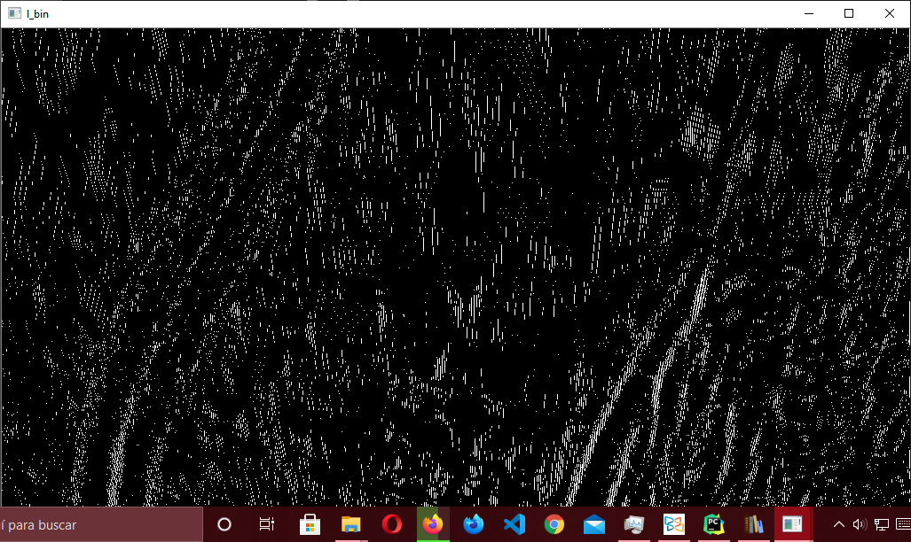

# Final project for the Digital Image Processing class

## About:
This project it's about performing a lane detection using a 
combination of filters (Computer Vision) in order to detect the 
lanes in an arbitrary image. I know machine learning its
more precise, but takes a lot of time in order to produce 
results, moreover, needs big datasets.

For a more detailed explanation of how the algorithm it's implemented you can 
visit [Lane detection with Computer Vision in Python](https://javarustacean.wordpress.com/2021/05/22/lane-detection-with-computer-vision-in-python/)

## Dependencies:
1. OpenCV
2. Numpy
3. SciPy

### The Beginning:
This work it's based on the paper[2], in the original paper they used a Sobel filter 
in order to obtain the straight lines in the images. What I use in this work is a 
Laplacian filter with an auxiliary step with Gaussian filter.

**Algorithm Workflow**

> How it works the algorithm

### Example image:

**Original Image**
We start with an arbitrary input image.

> Original Image

**Grey Blurred Image**
We standardize the size in order to make easy the next transformations, with this 
image we transform it from RGB to Gray ([n,n,3] -> [n,n,1] space transformation).
Next we denoise the image with the Gaussian filter. To make easy the search of the 
lanes we need to perform a Bird Eye transformation, see [2].

> Gaussian Filtered Image

> Bird's Eye perspective transformation

**Laplace Filter**
We apply a Laplacian filter to find the vertical lines.

> Laplacian filter applied.

**HSL Threshold**
We threshold the image in HSL space with the L channel (Luminance) to select
the white/yellow regions (lane marks). The HSL transformation its performed from
the original RGB image.

> RGB Perspective transformation

> HSL Thresholding with the L channel.

**Sliding Window Searching**
We combine the masks previously obtained to make the final mask, this final mask is
going to be analyzed in order to find the continuous lines in the image and draw our lane.

> Sliding window searching

**Drawed Lane**
Once we found the lines, it's time to apply draw this figure in the original image, 
to do this we need to perform the inverse Perspective transformation.

> Final Result

## Conclusions:
This algorithm shows a well performance under good light conditions, but is awful
with other images, this solution is worst than Machine Learning techniques, but
need too much less resources, and it's easier to implement. I think it worth the lack
of accuracy under certain scenarios.

## References:
>[1] H. Singh, Practical Machine Learning and Image Processing: For Facial 
> Recognition, Object Detection, and Pattern Recognition Using Python. Berkeley, 
> CA: Apress, 2019 [Online]. Disponible en: http://link.springer.com/10.1007/978-1-4842-4149-3. 
> [Accedido: 23-ene-2021]

>[2] K. Dinakaran, A. Stephen Sagayaraj, S. K. Kabilesh, T. Mani, A. Anandkumar, y G. Chandrasekaran, 
> «Advanced lane detection technique for structural highway based on computer 
> vision algorithm», Materials Today: Proceedings, p. S2214785320373302, oct. 2020, 
> doi: 10.1016/j.matpr.2020.09.605. 